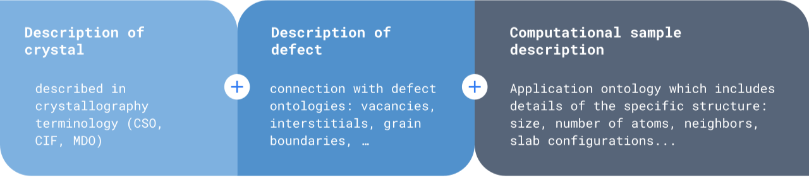

# IUC17_demonstrator

The [IUC17](https://nfdi-matwerk.de/infrastructure-use-cases/iuc17-ontologies-for-defects-in-crystals) demostrator is developed in the context of the NFDI-MatWerk conference. The specific user journey is the calculation of formation energies of vacancies.

- Application-level ontology for material science computational samples, CMSO, which initially describes samples on the atomistic level. _(TA-OMS)_
- The use of this ontology is aided by a software tool for automated annotation of structures using available atomic structural codes, pyscal_rdf. _(TA-WSD)_
- Pyscal-rdf provides a way for users of common atomistic structure codes to implement RDF store and SPARQL querying. 
- The use of this controlled vocabulary in a linked open data form ensures interoperability between different structural file formats and software, while also offering the possibility of making data findable and reusable.

## Using the demonstrator

The demonstrator can be used either through a graphical user interface or a jupyter notebook. The demonstrator can be run on the browser using the following links:

| Jupyter notebook  | GUI |
|-------------------|-----|
|   |   |

## Computational Material Sample Ontology (CMSO)
Semantic description of computational materials science samples (or structures). Initially focusing on the description at the atomic scale. Crystallographic defects are described in the POint Defect Ontology (PODO) and the PLane Defect Ontology (PLDO). 

CMSO can be found in the GitHub of the Institute for Materials Data Science and Informatics (IAS-9) of Forschungszentrum Jülich. [CMSO on GitHub](https://github.com/Materials-Data-Science-and-Informatics/cmso-ontology)

## pyscal_rdf
Python tool for ontology-based creation, manipulation, and quering of atomic structures. It is based on pyscal, a python library written in C++ for calculation of local atomic structural environment.

pyscal_rdf is developed in the pyscal GitHub organization. [Pyscal_rdf on GitHub](https://github.com/pyscal/pyscal_rdf) 

***
#### Support and contributing
For any questions or feedback, don't hesitate to contact us:

a.azocar.guzman@fz-juelich.de

matwerkoms@fz-juelich.de

#### Authors and acknowledgments
**TA-OMS:** Abril Guzman, Volker Hofmann, Stefan Sandfeld.

**TA-WSD:** Sarath Menon, Tilmann Hickel.

**Participant Projects:**
PP01: Mariano Forti, Thomas Hammerschmidt;
PP18: Birgit Skrotzki, Jürgen Olbricht, Luis Avila;
new PP: Rebecca Janisch, Markus Stricker.

This work is supported by the NFDI-Matwerk consortia.
